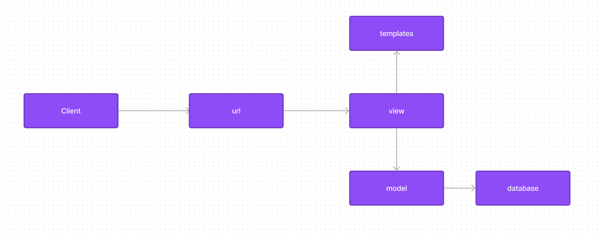
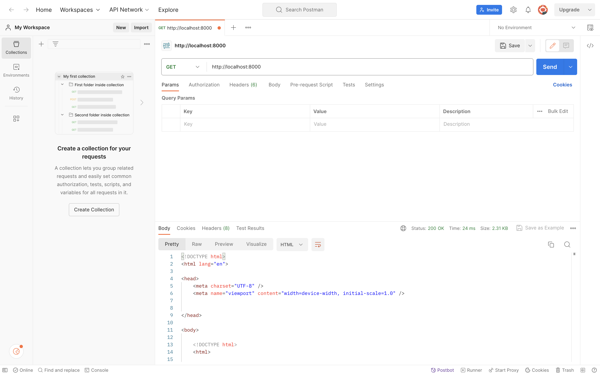
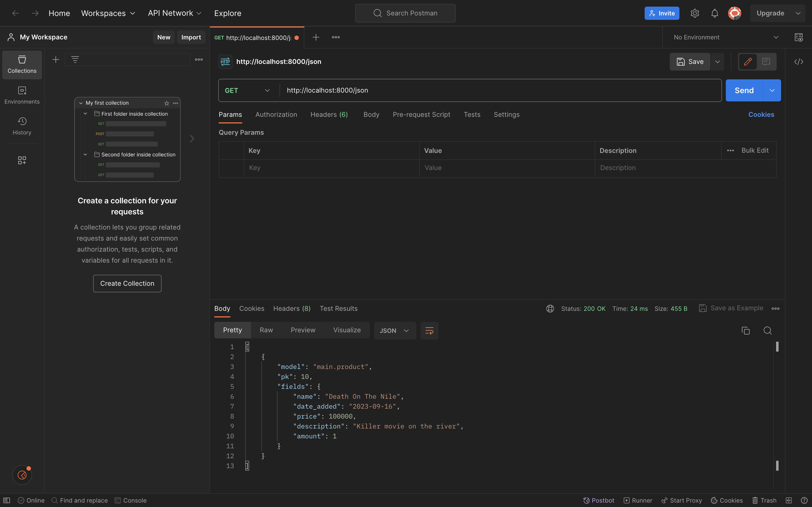
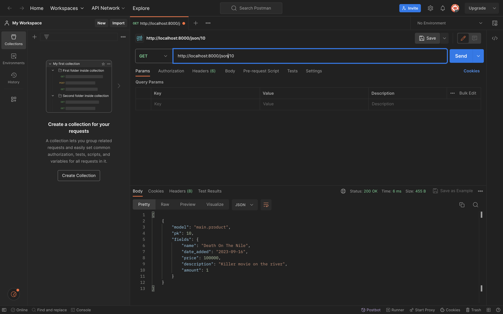
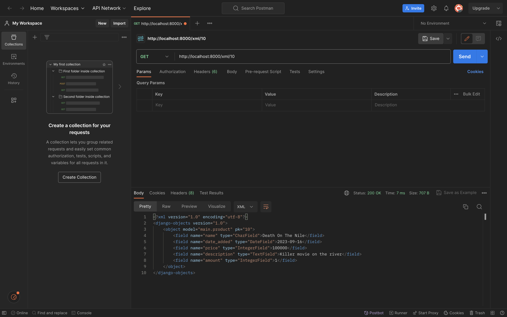

## Link adaptable ##
    https://stock-master.adaptable.app/

# TUGAS 2
## Cara membuat sebuah proyek Django baru yaitu ##
    Langkah 1: Membuat Direktori dan Mengaktifkan Virtual Environment
    # Buat direktori baru dan masuk ke dalamnya
    mkdir StockMaster
    cd StockMaster

    # Buat virtual environment dan aktifkan
    python -m venv env
    source env/bin/activate (di Unix/Mac)
    env\Scripts\activate (di Windows)

    Langkah 2: Menyiapkan Dependencies dan Membuat Proyek Django
    # Pasang dependencies
    pip install django gunicorn whitenoise psycopg2-binary requests urllib3

    # Buat proyek Django
    django-admin startproject StockMaster .

    # Tambahkan ALLOWED_HOSTS di settings.py

    Langkah 3: Menjalankan Server
    # Jalankan server Django
    python manage.py runserver

    Langkah 4: Menghentikan Server dan Menonaktifkan Virtual Environment
    # Untuk menghentikan server, tekan Ctrl+C
    # Nonaktifkan virtual environment
    deactivate

    Langkah 5: Mengunggah Proyek ke Repositori GitHub
    # Inisiasi direktori sebagai repositori Git
    git init

    # Tambahkan semua berkas ke repositori
    git add .

    # Buat berkas .gitignore
    # Isi .gitignore dengan aturan yang diperlukan

    # Lakukan commit awal
    git commit -m "Inisialisasi proyek Django"

    # Tambahkan repositori GitHub sebagai remote
    git remote add origin <URL repositori GitHub Anda>

    # Push proyek ke GitHub
    git push -u origin main

## Membuat aplikasi dengan nama main pada proyek tersebut. ##
    Langkah 1: Buat Aplikasi Main
    # Membuat aplikasi baru bernama "main"
    python manage.py startapp main

    Langkah 2: Mendaftarkan Aplikasi ke dalam Proyek
    Buka berkas settings.py yang terletak di dalam direktori proyek "shopping_list" Anda. Temukan variabel INSTALLED_APPS dan tambahkan nama aplikasi "main" ke dalam daftar aplikasi yang ada.
    INSTALLED_APPS = [
        # ...
        'main',
        # ...
    ]

## Melakukan routing pada proyek agar dapat menjalankan aplikasi main. ##
    Langkah 1: Buka berkas urls.py dalam direktori proyek "shopping_list" (bukan yang ada di dalam aplikasi "main").

    Langkah 2: Impor fungsi include dari django.urls.
    from django.urls import path, include

    Langkah 3: Tambahkan rute URL berikut ke dalam variabel urlpatterns untuk mengarahkan ke tampilan "main" yang akan didefinisikan dalam berkas urls.py aplikasi "main".
    urlpatterns = [
        # ...
        path('main/', include('main.urls')),
        # ...
    ]

    Langkah 4: Jalankan proyek Django dengan perintah:
    python manage.py runserver

    Langkah 5: Buka http://localhost:8000/main/ di peramban web Anda untuk melihat halaman yang sudah Anda buat.

## Membuat model pada aplikasi main dengan nama Item dan memiliki atribut wajib ##
    Langkah 1: Mengubah Berkas models.py dalam Aplikasi "main"

    Buka berkas models.py dalam direktori aplikasi "main".
    Tambahkan atau ubah model Anda seperti yang diinginkan. Misalnya:
    from django.db import models

    class Product(models.Model):
        name = models.CharField(max_length=255)
        date_added = models.DateField(auto_now_add=True)
        price = models.IntegerField()
        description = models.TextField()
        amount = models.IntegerField()

    Langkah 2: Membuat dan Mengaplikasikan Migrasi Model

    Untuk membuat migrasi model, jalankan perintah:
    python manage.py makemigrations

    Untuk menerapkan migrasi ke basis data lokal, jalankan perintah:
    python manage.py migrate

## Membuat sebuah fungsi pada views.py untuk dikembalikan ke dalam sebuah template HTML yang menampilkan nama aplikasi serta nama dan kelas ##
    Langkah 1: Mengintegrasikan Komponen MVT
    Buka berkas views.py dalam direktori aplikasi "main".
    Impor modul yang diperlukan dengan menambahkan baris berikut di bagian atas berkas:
    from django.shortcuts import render

    Tambahkan fungsi show_main di bawah impor:
    def show_main(request):
        context = {
            'name': 'Joseph Bintang Ardhirespati',
            'class': 'PBP D'
        }
        return render(request, "main.html", context)

## Membuat sebuah routing pada urls.py aplikasi main untuk memetakan fungsi yang telah dibuat pada views.py. ##
    Langkah 1: Mengonfigurasi Routing URL Aplikasi "main"

    Buat berkas urls.py dalam direktori "main" jika belum ada.
    Isi berkas urls.py dengan kode berikut:
    from django.urls import path
    from .views import show_main

    urlpatterns = [
        path('', show_main, name='show_main'),
    ]

    Penjelasan Kode dalam urls.py pada Aplikasi "main":

    Berkas urls.py pada aplikasi "main" bertanggung jawab untuk mengatur rute URL yang terkait dengan aplikasi "main".
    Impor path dari django.urls untuk mendefinisikan pola URL.
    Gunakan fungsi show_main dari modul .views (karena kita berada dalam direktori yang sama) sebagai tampilan yang akan ditampilkan ketika URL terkait diakses.
    Nama app_name dapat ditambahkan jika Anda ingin memberikan nama unik pada pola URL dalam aplikasi, tetapi dalam kasus ini, kami tidak menggunakannya.

## Melakukan deployment ke Adaptable terhadap aplikasi yang sudah dibuat sehingga nantinya dapat diakses oleh teman-temanmu melalui Internet. ##
    1.Buatlah akun Adaptable.io menggunakan akun GitHub yang digunakan untuk membuat proyek shopping_list.
    2.Jika sudah login, silakan tekan tombol New App. Pilih Connect an Existing Repository.
    3.Hubungkan Adaptable.io dengan GitHub dan pilih All Repositories pada proses instalasi.
    4.Pilihlah repositori proyek shopping_list sebagai basis aplikasi yang akan di-deploy. Pilih branch yang ingin dijadikan sebagai deployment branch.
    5.Pilihlah Python App Template sebagai template deployment.
    6.Pilih PostgreSQL sebagai tipe basis data yang akan digunakan.
    7.Sesuaikan versi Python dengan spesifikasi aplikasimu. Untuk mengeceknya, nyalakan virtual environment dan jalankan perintah python --version.
    8.Pada bagian Start Command masukkan perintah python manage.py migrate && gunicorn shopping_list.wsgi.
    9.Masukkan nama aplikasi yang juga akan menjadi nama domain situs web aplikasimu.
    10.Centang bagian HTTP Listener on PORT dan klik Deploy App untuk memulai proses deployment aplikasi.

## Buatlah bagan yang berisi request client ke web aplikasi berbasis Django beserta responnya dan jelaskan pada bagan tersebut kaitan antara urls.py, views.py, models.py, dan berkas html. ##

    # Request dari Klien ke Aplikasi Django:
    Klien (pengguna web) mengirim permintaan HTTP ke aplikasi Django melalui peramban web mereka.
    Permintaan ini biasanya berupa URL yang diketikkan oleh pengguna atau tindakan yang dilakukan di dalam aplikasi, seperti mengklik tautan atau mengirim formulir.
    # urls.py (Routing URL):
    Ketika permintaan tiba di server Django, berkas urls.py digunakan untuk mencocokkan URL yang diterima dengan pola URL yang telah didefinisikan di dalamnya.
    Pola URL digunakan untuk menentukan tindakan selanjutnya, yaitu fungsi tampilan mana yang harus menangani permintaan tersebut.
    # views.py (Fungsi Tampilan):
    Setelah pola URL cocok dengan URL yang diterima, fungsi tampilan yang sesuai di dalam berkas views.py akan dipanggil.
    Fungsi tampilan ini mengambil permintaan HTTP sebagai argumen dan dapat berinteraksi dengan model untuk mengambil atau memanipulasi data yang diperlukan.
    Fungsi tampilan kemudian mempersiapkan data yang akan ditampilkan di halaman web.
    # models.py (Model Basis Data):
    Fungsi tampilan dapat berinteraksi dengan model yang didefinisikan di dalam berkas models.py untuk mengakses atau memodifikasi data dalam basis data.
    Model ini mencerminkan struktur data dalam basis data dan memungkinkan penggunaan ORM (Object-Relational Mapping) untuk berinteraksi dengan basis data tanpa menulis SQL secara langsung.
    # Berkas HTML (Tampilan):
    Data yang telah dipersiapkan oleh fungsi tampilan akan diteruskan ke berkas HTML yang sesuai untuk merender halaman web.
    Berkas HTML mengandung kode HTML, serta template tag Django yang digunakan untuk mengambil dan menampilkan data yang diterima dari fungsi tampilan.
    Hasil akhirnya adalah halaman web yang dihasilkan yang siap untuk dikirimkan kembali ke klien.
    # Respon Kepada Klien:
    Setelah berkas HTML merender halaman, respon HTTP yang berisi halaman tersebut dikirimkan kembali kepada klien melalui jaringan.
    Klien akan menerima respon ini dan akan melihat halaman web yang telah dihasilkan oleh aplikasi Django.

## mengapa kita menggunakan virtual environment? Apakah kita tetap dapat membuat aplikasi web berbasis Django tanpa menggunakan virtual environment? ##
    # Isolasi Proyek: Virtual environment memungkinkan Anda membuat lingkungan kerja terisolasi untuk setiap proyek Python yang Anda kerjakan. Ini berarti bahwa semua dependensi proyek, termasuk versi spesifik dari pustaka dan paket Python, diisolasi dari proyek-proyek lain yang ada di komputer Anda. Dengan begitu, Anda dapat menghindari konflik antara versi pustaka dan mengisolasi setiap proyek dengan baik.
    # Menghindari Konflik Dependensi: Saat Anda bekerja pada berbagai proyek Python, beberapa proyek mungkin memerlukan versi pustaka yang berbeda. Virtual environment memungkinkan Anda untuk menginstal versi pustaka yang berbeda dalam setiap lingkungan proyek tanpa konflik.
    # Memudahkan Pemeliharaan: Dengan menggunakan virtual environment, Anda dapat mengelola dependensi proyek dengan lebih baik. Anda dapat membuat daftar dependensi (biasanya disimpan dalam berkas requirements.txt) yang mencantumkan semua pustaka yang dibutuhkan untuk proyek Anda. Ini mempermudah pemasangan ulang dependensi proyek di lingkungan lain atau bagi rekan pengembang yang bekerja pada proyek yang sama.
    # Keamanan: Virtual environment membantu menghindari perubahan tidak disengaja atau terlalu banyak akses ke sistem inti. Ini berarti jika ada kesalahan dalam proyek atau jika ada modifikasi yang tidak diinginkan, dampaknya akan dibatasi pada lingkungan virtual dan tidak akan memengaruhi instalasi Python sistem Anda.

    # Iya, Anda masih bisa membuat aplikasi web berbasis Django tanpa menggunakan virtual environment, tetapi sangat disarankan untuk menggunakan virtual environment.

## Jelaskan apakah itu MVC, MVT, MVVM dan perbedaan dari ketiganya. ##
    MVC, MVT, dan MVVM adalah tiga pola arsitektur perangkat lunak yang digunakan dalam pengembangan aplikasi untuk mengatur cara data, logika, dan tampilan diatur dan berinteraksi. Meskipun semuanya berbagi tujuan umum untuk memisahkan komponen-komponen utama aplikasi, mereka memiliki filosofi dan pengaturan yang berbeda. Berikut adalah penjelasan singkat tentang masing-masing dari mereka dan perbedaan antara ketiganya:

    # MVC (Model-View-Controller):
    -Model: Model merepresentasikan data dan bisnis logic aplikasi. Ini bertanggung jawab untuk mengelola, memproses, dan menyimpan data. Model tidak harus tahu tentang tampilan atau penggunaan akhir dari data ini.
    -View: View mengatur tampilan yang diberikan kepada pengguna. Ini bertanggung jawab untuk menampilkan data dari Model dalam format yang sesuai untuk tampilan. View tidak boleh memiliki logika bisnis.
    -Controller: Controller bertindak sebagai perantara antara Model dan View. Ini menerima input dari pengguna, memprosesnya, dan mengarahkan tindakan apa yang harus diambil berdasarkan input tersebut. Controller juga mengupdate Model atau View sesuai kebutuhan.
    -Perbedaan Utama: MVC adalah pola arsitektur yang sering digunakan dalam pengembangan aplikasi web tradisional, di mana View bertindak sebagai tampilan HTML yang disajikan kepada pengguna. Controller mengelola logika aplikasi dan menghubungkan Model dengan View. Model, View, dan Controller adalah tiga komponen utama yang terpisah secara tegas.

    # MVT (Model-View-Template):
    -Model: Model dalam MVT mirip dengan Model dalam MVC. Ini merepresentasikan data dan bisnis logic aplikasi. Model tidak tahu tentang tampilan.
    -View: View dalam MVT bertanggung jawab untuk mengatur tampilan, sama seperti dalam MVC. Namun, dalam konteks Django (sebuah kerangka kerja Python), View mengambil peran yang lebih besar daripada dalam MVC. View dalam Django adalah komponen yang mengelola logika aplikasi dan menentukan bagaimana data yang diterima dari Model akan ditampilkan dalam Template.
    -Template: Template dalam MVT adalah komponen yang memungkinkan Anda untuk mengatur tampilan HTML secara terpisah dari kode Python dalam View. Template adalah yang menentukan bagaimana data dari View akan ditampilkan kepada pengguna.
    -Perbedaan Utama: MVT adalah varian dari MVC yang digunakan dalam Django. Perbedaan utama adalah peran yang lebih kuat yang dimiliki oleh Template dalam Django untuk mengatur tampilan HTML.

    # MVVM (Model-View-ViewModel):
    -Model: Model dalam MVVM adalah komponen yang sama dengan dalam MVC dan MVT. Ini bertanggung jawab untuk data dan bisnis logic aplikasi.
    -View: View dalam MVVM mirip dengan View dalam MVC dan MVT. Ini bertanggung jawab untuk mengatur tampilan dan menampilkan data kepada pengguna.
    -ViewModel: ViewModel adalah komponen yang unik untuk MVVM. Ini berperan sebagai perantara antara Model dan View. ViewModel mengubah data dari Model ke format yang lebih cocok untuk tampilan dan menyediakannya ke View. ViewModel juga mengelola tindakan dan peristiwa yang terjadi di View.
    -Perbedaan Utama: MVVM adalah pola arsitektur yang sering digunakan dalam pengembangan aplikasi berbasis klien (seperti aplikasi web berbasis JavaScript atau aplikasi seluler). ViewModel adalah komponen yang memungkinkan pengikatan data dua arah antara Model dan View. Ini membantu memisahkan logika aplikasi dari tampilan, mirip dengan MVC dan MVT, tetapi dengan pendekatan yang lebih berfokus pada tampilan responsif.

# TUGAS 3
## Apa perbedaan antara form POST dan form GET dalam Django? 
    Metode HTTP:
    -POST: Metode ini digunakan untuk mengirim data ke server dengan cara yang aman dan tidak terlihat oleh pengguna. Data yang dikirimkan dengan metode POST dikirimkan sebagai bagian dari badan permintaan HTTP, sehingga lebih aman untuk data sensitif seperti kata sandi. Formulir dengan metode POST biasanya digunakan untuk mengirim data yang akan diolah oleh server, seperti membuat, mengedit, atau menghapus entitas dalam basis data.
    -GET: Metode ini digunakan untuk mengirimkan data sebagai bagian dari URL. Data yang dikirimkan dengan metode GET terlihat dalam URL, sehingga tidak aman untuk data sensitif. Metode ini cocok untuk mengambil data dari server, seperti pencarian atau pengambilan informasi, tetapi tidak seharusnya digunakan untuk mengirim data yang harus diamankan.
    Pengiriman Data:
    -POST: Data dikirimkan sebagai badan permintaan HTTP dan tidak terlihat dalam URL. Oleh karena itu, lebih cocok digunakan untuk mengirim data yang sensitif atau besar.
    -GET: Data dikirimkan sebagai parameter query dalam URL. Data ini terlihat oleh pengguna dan dapat dilihat dalam log server atau riwayat peramban. Sebaiknya digunakan untuk data yang tidak sensitif atau saat Anda ingin membuat URL yang dapat dibagikan.
    Batasan Panjang Data:
    -POST: Tidak ada batasan panjang bawaan untuk data yang dikirimkan dengan metode POST.
    -GET: Terdapat batasan panjang URL yang berbeda-beda pada server dan peramban. Batasan ini dapat membatasi jumlah data yang dapat dikirimkan dengan metode GET.
    Keamanan:
    -POST: Lebih aman untuk mengirim data sensitif karena tidak terlihat dalam URL. Namun, ini tidak berarti data POST selalu aman jika tidak diimplementasikan dengan benar. Perlindungan tambahan seperti Cross-Site Request Forgery (CSRF) harus diterapkan untuk mencegah serangan.
    -GET: Kurang aman karena data terlihat dalam URL dan dapat diakses dengan mudah oleh pihak ketiga.

## Apa perbedaan utama antara XML, JSON, dan HTML dalam konteks pengiriman data?
    -XML (eXtensible Markup Language):
    Tujuan Utama: XML dirancang untuk menyimpan dan mentransmisikan data, serta memudahkan pertukaran informasi antara sistem yang berbeda. Ini adalah bahasa markup serba guna.
    Struktur: XML adalah bahasa markup yang memungkinkan pengguna untuk mendefinisikan struktur data mereka sendiri menggunakan tag dan aturan tertentu. Ini membuatnya sangat fleksibel, tetapi juga dapat membutuhkan lebih banyak upaya untuk mengonfigurasi dan membaca data dibandingkan dengan format lain.
    Contoh Penggunaan: XML sering digunakan dalam protokol pertukaran data, seperti SOAP (Simple Object Access Protocol) untuk komunikasi web services.
    -JSON (JavaScript Object Notation):
    Tujuan Utama: JSON adalah format ringkas dan mudah dibaca yang digunakan untuk pertukaran data. Ini adalah bagian integral dari pengembangan aplikasi web modern dan sering digunakan dalam komunikasi antara server dan klien.
    Struktur: JSON terdiri dari pasangan kunci-nilai (key-value pairs) yang terorganisir dengan baik. Format ini merupakan representasi yang lebih langsung dari objek dalam bahasa pemrograman seperti JavaScript, Python, dan banyak bahasa lainnya.
    Contoh Penggunaan: JSON banyak digunakan dalam RESTful API (Application Programming Interface) untuk mentransmisikan data antara klien dan server.
    -HTML (HyperText Markup Language):
    Tujuan Utama: HTML adalah bahasa markup yang digunakan untuk membuat dan memformat halaman web. Ini tidak dirancang untuk mentransmisikan data mentah, tetapi untuk menyajikan informasi dalam bentuk yang dapat diakses dan dapat diinterpretasi oleh peramban web.
    Struktur: HTML mengandung elemen-elemen markup yang mendefinisikan struktur halaman web. Ini termasuk elemen untuk judul, paragraf, gambar, tautan, dan banyak lagi.
    Contoh Penggunaan: HTML digunakan untuk membuat halaman web dan menyajikan konten kepada pengguna melalui peramban web.

##  Mengapa JSON sering digunakan dalam pertukaran data antara aplikasi web modern?
    -Ringkas dan Mudah Dibaca: JSON memiliki format yang sederhana dan mudah dibaca oleh manusia. Data dalam JSON direpresentasikan dalam pasangan kunci-nilai (key-value pairs) yang membuatnya intuitif dan mudah dipahami.
    -Ringan: JSON memiliki overhead yang rendah dalam hal ukuran data. Ini membuatnya efisien dalam pengiriman melalui jaringan, yang penting dalam aplikasi web yang memerlukan respons cepat.
    -Pendukung yang Luas: JSON didukung oleh sebagian besar bahasa pemrograman, termasuk JavaScript, Python, Java, PHP, dan banyak lainnya. Ini memudahkan pengolahan data JSON di berbagai sisi, baik di sisi klien maupun server.
    -Kompatibel dengan JavaScript: JSON adalah bagian integral dari JavaScript, sehingga cocok untuk digunakan dalam aplikasi web berbasis JavaScript. Ini memudahkan penggunaan data JSON dalam kode JavaScript tanpa perlu konversi atau parsing yang rumit.
    -Serialisasi dan Deserialisasi Mudah: JSON mudah untuk diserialisasi (mengonversi dari objek ke JSON) dan deserialisasi (mengonversi dari JSON ke objek). Ini menjadikannya pilihan yang baik untuk mentransmisikan objek atau data antara klien dan server.
    -Dukungan untuk Struktur Data Bersarang: JSON mendukung struktur data bersarang, yang memungkinkan Anda menyimpan data yang kompleks dan berlapis. Anda dapat membuat objek dalam objek, larik dalam objek, atau sebaliknya, yang sangat berguna untuk menggambarkan struktur data yang lebih kompleks.
    -Kemudahan Penggunaan dalam RESTful API: JSON menjadi format yang paling umum digunakan dalam RESTful API (Application Programming Interface), yang merupakan pendekatan populer untuk mengembangkan layanan web. Dalam RESTful API, data seringkali dikirim dan diterima dalam format JSON.
    -Komunitas dan Dukungan: JSON memiliki komunitas yang besar dan aktif, serta banyak alat dan pustaka yang tersedia untuk bekerja dengan format ini. Hal ini memudahkan pengembang untuk mengimplementasikan pertukaran data JSON dalam aplikasi mereka.

## Membuat input form untuk menambahkan objek model pada app sebelumnya.
    1.Buat berkas baru bernama forms.py dalam direktori main dengan kode berikut:
    from django.forms import ModelForm
    from main.models import Product

    class ProductForm(ModelForm):
        class Meta:
            model = Product
            fields = ["name", "price", "description"]

    2.Buka berkas views.py dalam folder main dan tambahkan impor berikut di bagian paling atas:
    from django.http import HttpResponseRedirect
    from main.forms import ProductForm
    from django.urls import reverse

    3.Tambahkan fungsi create_product pada berkas tersebut:
    def create_product(request):
    form = ProductForm(request.POST or None)

    if form.is_valid() and request.method == "POST":
        form.save()
        return HttpResponseRedirect(reverse('main:show_main'))

    context = {'form': form}
    return render(request, "create_product.html", context)

    4.Ubah fungsi show_main yang sudah ada pada berkas views.py menjadi seperti berikut:
    def show_main(request):
    products = Product.objects.all()

    context = {
        'name': 'Pak Bepe',
        'class': 'PBP A',
        'products': products
    }

    return render(request, "main.html", context)

    5.Buka berkas urls.py dalam folder main dan impor fungsi create_product yang telah Anda buat:
    from main.views import show_main, create_product

    6.Tambahkan path URL berikut ke dalam urlpatterns di berkas urls.py untuk mengakses fungsi yang sudah di-import:
    path('create-product', create_product, name='create_product'),

    7.Buat berkas HTML baru bernama create_product.html dalam direktori main/templates dengan kode berikut:
    

    
    <h1>Add New Product</h1>

    <form method="POST">
        
        <table>
            {{ form.as_table }}
            <tr>
                <td></td>
                <td>
                    <input type="submit" value="Add Product"/>
                </td>
            </tr>
        </table>
    </form>

    

    8.Tambahkan kode berikut ke dalam berkas main.html untuk menampilkan data produk dalam tabel serta tombol "Add New Product" yang akan mengarahkan ke halaman form:
        ...
    <table>
        <tr>
            <th>Name</th>
            <th>Price</th>
            <th>Description</th>
            <th>Date Added</th>
        </tr>

        
            <tr>
                <td>{{product.name}}</td>
                <td>{{product.price}}</td>
                <td>{{product.description}}</td>
                <td>{{product.date_added}}</td>
            </tr>
        
    </table>

     

    <a href="">
        <button>
            Add New Product
        </button>
    </a>
    ...

    9.Jalankan proyek Django dengan perintah python manage.py runserver dan buka http://localhost:8000 di browser Anda. Anda sekarang dapat menambahkan data produk baru dan melihatnya pada halaman utama aplikasi.

## Tambahkan 5 fungsi views untuk melihat objek yang sudah ditambahkan dalam format HTML, XML, JSON, XML by ID, dan JSON by ID.
    -Melihat Objek dalam Format HTML:
    def show_main(request):
    products = Product.objects.all()

    context = {
        'name': 'Joseph Bintang Ardhirespati',
        'class': 'PBP D',
        'products': products
    }

    return render(request, "main.html", context)

    -Melihat Objek dalam Format XML:
    def show_xml(request):
    data = Product.objects.all()
    return HttpResponse(serializers.serialize("xml", data), content_type="application/xml")

    -Melihat Objek dalam Format JSON:
    def show_json(request):
    data = Product.objects.all()
    return HttpResponse(serializers.serialize("json", data), content_type="application/json")

    -Melihat Objek dalam Format XML berdasarkan ID:
    def show_xml_by_id(request, id):
    data = Product.objects.filter(pk=id)
    return HttpResponse(serializers.serialize("xml", data), content_type="application/xml")

    -Melihat Objek dalam Format JSON berdasarkan ID:
    def show_json_by_id(request, id):
    data = Product.objects.filter(pk=id)
    return HttpResponse(serializers.serialize("json", data), content_type="application/json")

## Membuat routing URL untuk masing-masing views yang telah ditambahkan
    Tambahkan path url ke dalam urlpatterns untuk mengakses fungsi yang sudah diimpor:
    urlpatterns = [
        path('', show_main, name='show_main'),
        path('create-product', create_product, name='create_product'),
        path('xml/', show_xml, name='show_xml'),
        path('json/', show_json, name='show_json'),
        path('xml/<int:id>/', show_xml_by_id, name='show_xml_by_id'),
        path('json/<int:id>/', show_json_by_id, name='show_json_by_id'),
    ]

## Mengakses kelima URL di poin 2 menggunakan Postman, membuat screenshot dari hasil akses URL pada Postman, dan menambahkannya ke dalam README.md.

# TUGAS 4
## Mengimplementasikan fungsi registrasi, login, dan logout untuk memungkinkan pengguna untuk mengakses aplikasi sebelumnya dengan lancar.
    # Membuat Fungsi dan Form Registrasi
        1. Jalankan virtual environment Anda.
        2. Buka file views.py dalam subdirektori main dan tambahkan import ini
        from django.shortcuts import redirect
        from django.contrib.auth.forms import UserCreationForm
        from django.contrib import messages

        setelah itu masukkan kode ini
        def register(request):
            form = UserCreationForm()

            if request.method == "POST":
                form = UserCreationForm(request.POST)
                if form.is_valid():
                    form.save()
                    messages.success(request, 'Your account has been successfully created!')
                    return redirect('main:login')
            context = {'form':form}
            return render(request, 'register.html', context)
        3. Buatlah file baru dengan nama register.html pada folder main/templates lalu masukan kode ini
        

        
            <title>Register</title>
        

        

        

            
            <h1>Register</h1>

                <form method="POST" >
                    
                    <table>
                        {{ form.as_table }}
                        <tr>
                            <td></td>
                            <td><input type="submit" name="submit" value="Daftar"/></td>
                        </tr>
                    </table>
                </form>

            
                <ul>
                    
                        <li>{{ message }}</li>
                        
                </ul>
            

        

        
        4. Buka urls.py pada subdirektori main, lalu tambah import ini
        from main.views import register #pastikan import sesuai dengan fungsi yang sudah anda buat
        5. Tambahkan path url ini pada urls.py
        path('register/', register, name='register'), #Sesuaikan dengan fungsi yang sudah anda buat

    # Membuat fungsi login
        1. Buka views.py pada subdirektori main lalu masukan import dibawah ini
        from django.contrib.auth import authenticate, login

        masukan kode ini
        def login_user(request):
            if request.method == 'POST':
                username = request.POST.get('username')
                password = request.POST.get('password')
                user = authenticate(request, username=username, password=password)
                if user is not None:
                    login(request, user)
                    return redirect('main:show_main')
                else:
                    messages.info(request, 'Sorry, incorrect username or password. Please try again.')
            context = {}
            return render(request, 'login.html', context)
        2. Buatlah file baru dengan nama login.html pada folder main/templates lalu masukan kode ini
        

        
            <title>Login</title>
        

        

        

            <h1>Login</h1>

            <form method="POST" action="">
                
                <table>
                    <tr>
                        <td>Username: </td>
                        <td><input type="text" name="username" placeholder="Username" class="form-control"></td>
                    </tr>
                            
                    <tr>
                        <td>Password: </td>
                        <td><input type="password" name="password" placeholder="Password" class="form-control"></td>
                    </tr>

                    <tr>
                        <td></td>
                        <td><input class="btn login_btn" type="submit" value="Login"></td>
                    </tr>
                </table>
            </form>

            
                <ul>
                    
                        <li>{{ message }}</li>
                    
                </ul>
            
                
            Don't have an account yet? <a href="">Register Now</a>

        

        
        3. Buka urls.py pada subdirektori main, lalu tambah import ini
        from main.views import login_user #Sesuaikan dengan fungsi yang anda buat
        4. Tambahkan path url ini pada urls.py
        path('login/', login_user, name='login'), #Sesuaikan dengan fungsi yang anda buat

    # Membuat fungsi logout
        1. Buka views.py pada subdirektori main lalu masukan import dibawah ini
        from django.contrib.auth import logout

        Lalu masukkan kode ini
        def logout_user(request):
            logout(request)
            return redirect('main:login')
        2. Buka file main.html pada folder main/templates lalu masukan kode ini
        ...
        <a href="">
            <button>
                Logout
            </button>
        </a>
        ...
        3. Buka urls.py pada subdirektori main, lalu tambah import ini
        from main.views import logout_user
        4.Tambahkan path url ini pada urls.py
        path('logout/', logout_user, name='logout'),

## Menghubungkan model Item dengan User.
    1. Buka main/models.py dan import model di bawah ini
    from django.contrib.auth.models import User
    2. Pada model Product yang sudah dibuat, tambahkan variabel user pada class Item yang berfungsi untuk menghubungkan satu produk dengan satu user melalui sebuah hubungan
    class Product(models.Model):
    user = models.ForeignKey(User, on_delete=models.CASCADE)
    3. Ubah function create_product pada main/views.py dan tambahkan variabel name pada function show_main
    def show_main(request):
        products = Product.objects.filter(user=request.user)

        context = {
            'name': request.user.username,
            ...
        }
    ...

    def create_product(request):
        form = ProductForm(request.POST or None)

        if form.is_valid() and request.method == "POST":
            product = form.save(commit=False)
            product.user = request.user
            product.save()
            return HttpResponseRedirect(reverse('main:show_main'))

        context = {'form': form}
        return render(request, "create_product.html", context)
    4. Kemudian, lakukan migrasi model dengan python manage.py makemigrations. Jika ada pesan error, maka pilih opsi 1 untuk menetapkan default value untuk field user pada semua row yang telah dibuat pada basis data dan ketik 1 lagi untuk menetapkan user dengan ID 1 pada model yang sudah ada
    5. Jika sudah berhasil, lanjutkan migrasi model dengan python manage.py migrate. Maka, semua model berhasil diperbarui

## Menampilkan detail informasi pengguna yang sedang logged in seperti username dan menerapkan cookies seperti last login pada halaman utama aplikasi.
    1. Buka main/views.py dan import 3 method di bawah ini.
    import datetime
    from django.http import HttpResponseRedirect
    from django.urls import reverse
    2. Di file yang sama, cari function login_user dan ubah pada if conditional state bagian if user is not None
    if user is not None:
        login(request, user)
        response = HttpResponseRedirect(reverse("main:show_main"))
        response.set_cookie('last_login', str(datetime.datetime.now()))
        return response
    3. Pada variabel context dalam fungsi show_main, tambahkan variabel last_loginke dalam variabel context ke dalamnya dan perbarui isi dari function logout_user
    ...
    context = {
            'creator': 'Rakha Fadil Atmojo',
            'pbpclass': 'PBP C',
            'npm': '2206082985',
            'item': products,
            'total_items': len(products),
            'last_login': request.COOKIES.get('last_login', 'N/A'),
        }
    ...

    def logout_user(request):
        logout(request)
        response = HttpResponseRedirect(reverse('main:login'))
        response.delete_cookie('last_login')
        return response
    4. Tambahkan kode di bawah ini untuk menampilkan data last login (nama dan waktu)
    <h5>Sesi terakhir login: {{ name }} - {{ last_login }}</h5>
    5. Untuk melihat data cookie last_login, kita bisa akses melalui Inspect > Application > Storage > Cookies

## Apa itu Django UserCreationForm, dan jelaskan apa kelebihan dan kekurangannya?
    UserCreationForm adalah sebuah kelas formulir di Django yang digunakan untuk menangani pendaftaran pengguna baru. Ini adalah bagian dari django.contrib.auth.forms dan adalah formulir bawaan yang disediakan oleh Django untuk memudahkan proses pembuatan akun pengguna. Formulir ini biasanya akan mencakup field-field standar seperti username, password, dan password confirmation.

    Kelebihan:
    Kemudahan Penggunaan: Karena merupakan fitur bawaan dari Django, UserCreationForm sangat mudah diintegrasikan ke dalam proyek Anda.
    Keamanan: Fitur keamanan dasar seperti validasi password sudah diatur oleh Django, sehingga Anda tidak perlu mengkhawatirkannya.
    Dokumentasi yang Baik: Sebagai bagian dari framework Django, UserCreationForm didokumentasikan dengan baik dan banyak tutorial yang bisa digunakan sebagai panduan.
    Ekstensibilitas: Meskipun merupakan formulir bawaan, UserCreationForm tetap bisa dikustomisasi untuk menambahkan field-field tambahan sesuai kebutuhan.
    Cepat dan Efisien: Menggunakan UserCreationForm dapat menghemat waktu dan upaya karena banyak fungsi yang sudah diotomatisasi.

    Kekurangan:
    Kurang Fleksibel: Meski dapat dikustomisasi, tingkat fleksibilitasnya terbatas bila dibandingkan dengan membuat formulir dari awal.
    Kompleksitas: Untuk pengembang yang baru mengenal Django, penggunaan dan modifikasi UserCreationForm bisa jadi membingungkan.
    Fitur Terbatas: Formulir ini terfokus pada fungsionalitas dasar, jadi jika Anda memerlukan fitur yang lebih kompleks (seperti CAPTCHA, verifikasi email, dll.), Anda harus menambahkannya sendiri.
    Tidak Cocok untuk Semua Kasus: Dalam skenario di mana Anda membutuhkan kontrol lebih atau fitur khusus yang tidak disediakan oleh UserCreationForm, Anda mungkin perlu memilih untuk membuat formulir Anda sendiri dari awal.

## Apa perbedaan antara autentikasi dan otorisasi dalam konteks Django, dan mengapa keduanya penting?
    Autentikasi:
    Dalam konteks Django, autentikasi merujuk pada proses verifikasi identitas pengguna. Ini biasanya dilakukan melalui username dan password, tetapi bisa juga melibatkan metode lain seperti token atau autentikasi dua faktor. Django menyediakan bantuan bawaan untuk autentikasi melalui modul django.contrib.auth.

    Otorisasi:
    Otorisasi, di sisi lain, adalah proses yang menentukan apa yang diizinkan untuk dilakukan oleh pengguna yang telah terautentikasi. Ini melibatkan pembatasan akses ke sumber daya tertentu, seperti halaman web, fungsi, atau data, berdasarkan peran atau atribut lain dari pengguna. Django juga menyediakan beberapa cara untuk menangani otorisasi, seperti decorators @login_required dan @permission_required, serta sistem perizinan.

    Mengapa Keduanya Penting?
    Keamanan: Tanpa autentikasi dan otorisasi, sebuah aplikasi akan sangat rentan terhadap ancaman keamanan seperti akses tidak sah dan penyalahgunaan informasi.
    Pengalaman Pengguna: Dengan sistem otorisasi yang baik, Anda bisa membuat aplikasi yang menyesuaikan fitur dan konten berdasarkan peran atau preferensi pengguna.
    Pemisahan Tanggung Jawab: Otorisasi memungkinkan Anda untuk memisahkan apa yang bisa dilakukan oleh berbagai jenis pengguna, seperti admin vs. pengguna biasa, sehingga mempermudah manajemen aplikasi.
    Kepatuhan dan Audit: Di banyak sektor, ada kebutuhan untuk mematuhi standar keamanan tertentu yang mengharuskan penggunaan autentikasi dan otorisasi yang kuat.
    Scalability: Kedua mekanisme ini mempermudah manajemen sumber daya dan akses dalam skala yang lebih besar, membuatnya lebih mudah untuk menambah atau mengubah fitur keamanan sesuai kebutuhan.

## Apa itu cookies dalam konteks aplikasi web, dan bagaimana Django menggunakan cookies untuk mengelola data sesi pengguna?
    Cookies adalah potongan kecil data yang disimpan oleh browser web di sisi klien. Biasanya, mereka digunakan untuk menyimpan informasi yang digunakan untuk berbagai tujuan, seperti pelacakan sesi pengguna, penyimpanan preferensi, dan bahkan otentikasi. Setiap kali browser membuat permintaan ke server yang sama, cookie ini akan dikirimkan kembali ke server, sehingga server bisa mengakses data yang sebelumnya disimpan.

    Bagaimana Django Menggunakan Cookies untuk Mengelola Data Sesi Pengguna?
    Pembuatan Sesi: Saat sebuah sesi dibuat (biasanya saat pengguna pertama kali mengakses aplikasi), Django secara otomatis akan membuat ID sesi unik dan menyimpannya dalam cookie pada browser pengguna.
    Penyimpanan Data Sesi: Data sesi biasanya disimpan di server (misalnya, di database atau cache), meskipun ID sesi itu sendiri disimpan dalam cookie. Django juga mendukung penyimpanan data sesi di sisi klien.
    Retrieval Data: Ketika pengguna kembali mengakses aplikasi, Django akan membaca ID sesi dari cookie, mencari data sesi yang sesuai di server, dan memuatnya ke dalam konteks permintaan, sehingga aplikasi bisa merespon sesuai dengan data sesi.
    Keamanan: Django menyediakan berbagai mekanisme untuk meningkatkan keamanan cookie, seperti penggunaan flag "secure" untuk memastikan cookie hanya dikirim melalui HTTPS, atau flag "HttpOnly" yang mencegah akses ke cookie melalui JavaScript, mengurangi risiko serangan cross-site scripting (XSS).
    Pembersihan dan Kedaluwarsa: Sesi akan berakhir setelah periode waktu tertentu atau saat pengguna keluar dari aplikasi. Django akan menghapus data sesi dari server dan menghapus cookie atau mengatur ulang nilai kedaluwarsanya.
    Customisasi: Django memungkinkan Anda untuk menyesuaikan cara kerja sesi sesuai kebutuhan aplikasi Anda, seperti memilih mekanisme penyimpanan sesi atau mengkonfigurasi umur sesi.

## Apakah penggunaan cookies aman secara default dalam pengembangan web, atau apakah ada risiko potensial yang harus diwaspadai?
    Penggunaan cookies dalam pengembangan web memiliki potensi risiko yang perlu diwaspadai, meskipun banyak mekanisme keamanan yang bisa diaplikasikan untuk memitigasi risiko ini. Berikut adalah beberapa poin mengenai keamanan cookies:

    Risiko Potensial:
    Cross-Site Scripting (XSS): Jika sebuah situs rentan terhadap serangan XSS, penyerang bisa mencuri cookies yang tidak dilindungi oleh flag HttpOnly.
    Cross-Site Request Forgery (CSRF): Penyerang bisa memanfaatkan cookies untuk melakukan tindakan berbahaya atas nama pengguna yang telah terotentikasi tanpa sepengetahuan mereka.
    Man-in-the-Middle Attack: Jika cookies disampaikan melalui koneksi yang tidak aman (misalnya, HTTP bukan HTTPS), penyerang yang bisa memantau komunikasi antara client dan server bisa mencuri cookies.
    Session Hijacking: Jika ID sesi disimpan dalam cookie, dan cookie ini dikompromikan, maka sesi pengguna juga bisa diambil alih oleh penyerang.
    Storage on Client Side: Cookies disimpan di sisi klien, yang berarti pengguna atau pihak ketiga berpotensi mengaksesnya, memanipulasinya, atau bahkan menghapusnya.

# Tugas 5
## Jelaskan manfaat dari setiap element selector dan kapan waktu yang tepat untuk menggunakannya.
    1. Universal Selector (*):
    Manfaat: Memilih semua elemen pada halaman.
    Kapan Menggunakannya: Saat Anda ingin menerapkan gaya ke semua elemen tanpa terkecuali. Contohnya, untuk mengatur margin dan padding default menjadi nol untuk semua elemen.
    2 Type Selector / Element Selector (e.g., h1, p):
    Manfaat: Memilih semua elemen dengan jenis tertentu.
    Kapan Menggunakannya: Saat Anda ingin menerapkan gaya ke semua elemen dari jenis tertentu.
    3. Class Selector (e.g., .classname):
    Manfaat: Memilih elemen berdasarkan kelas tertentu.
    Kapan Menggunakannya: Saat Anda ingin menerapkan gaya khusus ke sekelompok elemen yang memiliki kelas tertentu. Sangat berguna saat beberapa elemen memerlukan gaya yang sama, tetapi tidak semua elemen dari jenis yang sama perlu digayakan dengan cara itu.
    4. ID Selector (e.g., #idname):
    Manfaat: Memilih elemen berdasarkan ID-nya.
    Kapan Menggunakannya: Saat Anda ingin menerapkan gaya pada satu elemen spesifik. ID harus unik dalam halaman, jadi gunakan ini untuk gaya yang sangat spesifik dan unik.
    5. Descendant Selector (e.g., article p):
    Manfaat: Memilih elemen berdasarkan keturunannya.
    Kapan Menggunakannya: Saat Anda ingin menerapkan gaya ke elemen yang berada di dalam elemen lain.
    6. Child Selector (e.g., ul > li):
    Manfaat: Memilih elemen yang merupakan anak langsung dari elemen lain.
    Kapan Menggunakannya: Saat Anda ingin menerapkan gaya hanya ke anak-anak langsung, dan tidak kepada anak-anak dari anak-anak tersebut.
    7. Attribute Selector (e.g., [attr=value]):
    Manfaat: Memilih elemen berdasarkan atribut dan nilainya.
    Kapan Menggunakannya: Saat Anda ingin menerapkan gaya berdasarkan atribut tertentu dari elemen, seperti type, href, atau atribut lainnya.

## Jelaskan HTML5 Tag yang kamu ketahui.
    HTML5 memperkenalkan sejumlah tag baru yang dirancang untuk membuat struktur konten web menjadi lebih semantik dan aksesibel. Berikut adalah sejumlah tag HTML5 yang penting:

    <!DOCTYPE html>: Meskipun bukan tag baru, deklarasi doctype ini adalah cara yang disederhanakan untuk mendefinisikan halaman sebagai HTML5.
    <header>: Menentukan header untuk dokumen atau bagian. Biasanya berisi logo, judul situs, dan navigasi utama.
    <footer>: Menentukan footer untuk dokumen atau bagian. Biasanya berisi informasi hak cipta, link ke kebijakan privasi, dan informasi kontak.
    <nav>: Digunakan untuk mengelompokkan elemen navigasi utama, seperti menu.
    <article>: Menentukan konten independen yang seharusnya dapat berdiri sendiri dan memiliki arti jika diletakkan di luar konteks halaman, seperti postingan blog.
    <section>: Menentukan bagian dalam dokumen, seperti bab, tab, atau halaman beranda.
    <aside>: Menentukan konten yang agak terpisah dari konten utama, sering digunakan untuk sidebar.
    <hgroup>: Mengelompokkan elemen heading (<h1> hingga <h6>) ketika judul dan subjudul diperlukan.
    <figure> & <figcaption>: <figure> digunakan untuk mengelompokkan konten referensi, seperti gambar, diagram, foto, kode, sementara <figcaption> digunakan untuk memberikan keterangan atau legenda untuk <figure>.
    <time>: Menyatakan waktu (24 jam) atau tanggal, dengan atribut datetime untuk klarifikasi.
    <mark>: Digunakan untuk menyoroti bagian dari teks.
    <progress> & <meter>: <progress> menampilkan bar kemajuan untuk tugas yang sedang berlangsung, sementara <meter> menunjukkan ukuran dalam rentang yang didefinisikan.
    
 & 
: 
 digunakan untuk menyembunyikan dan menampilkan konten tambahan, dengan 
 memberikan deskripsi atau ringkasan dari konten yang disembunyikan.
    <canvas>: Elemen untuk menggambar grafik pada halaman web via scripting (biasanya dengan JavaScript).
    <audio> & <video>: Digunakan untuk menyematkan konten audio dan video. Mereka bisa digabung dengan elemen seperti <source> untuk mendefinisikan sumber media.
    <datalist>: Digunakan dengan <input> untuk menyediakan daftar pilihan yang disarankan bagi pengguna.
    <output>: Menampilkan hasil dari perhitungan.
    <wbr>: Menunjukkan di mana dalam teks mungkin adalah tempat yang baik untuk memutuskan garis jika diperlukan.

## Jelaskan perbedaan antara margin dan padding.
    Margin dan Padding adalah dua properti dasar dalam CSS yang mengontrol ruang di sekitar elemen, tetapi mereka berfungsi sedikit berbeda. Mari kita jelaskan perbedaannya:

    Padding:
    Definisi: Padding adalah ruang antara konten elemen dengan batas atau border elemen tersebut.
    Posisi: Berada di dalam elemen, di antara konten sebenarnya (seperti teks atau gambar) dan border elemen.
    Penggunaan: Biasanya digunakan untuk memberi ruang di sekitar konten elemen, menjauhkannya dari batas atau border elemen. Misalnya, jika Anda memiliki tombol dengan teks di dalamnya, menambahkan padding akan membuat teks tidak terlalu dekat dengan tepi tombol.
    Warna: Jika elemen memiliki latar belakang (background color), padding akan mewarisi warna latar belakang tersebut.

    Margin:
    Definisi: Margin adalah ruang di luar batas atau border elemen, yang memisahkannya dari elemen lain.
    Posisi: Berada di luar elemen, di luar border elemen.
    Penggunaan: Biasanya digunakan untuk memberi ruang antara elemen dengan elemen lain di sekitarnya. Misalnya, Anda mungkin ingin memberi margin kepada sebuah paragraf untuk memastikan bahwa tidak ada elemen lain yang terlalu dekat dengannya.
    Warna: Margin selalu transparan, tidak peduli apakah elemen memiliki latar belakang atau tidak.

## Jelaskan perbedaan antara framework CSS Tailwind dan Bootstrap. Kapan sebaiknya kita menggunakan Bootstrap daripada Tailwind, dan sebaliknya?
    Tailwind CSS dan Bootstrap adalah dua framework CSS populer, tetapi mereka memiliki pendekatan yang berbeda dalam hal desain dan penggunaannya. Mari kita jelaskan perbedaannya:

    Pendekatan:
    Bootstrap: Merupakan sebuah framework berbasis komponen. Bootstrap menyediakan sejumlah komponen desain siap pakai (seperti navigasi, modals, dropdowns, dan lain-lain) yang bisa Anda gunakan langsung dengan menambahkan kelas-kelas tertentu ke elemen HTML Anda.
    Tailwind CSS: Merupakan sebuah framework berbasis utilitas. Alih-alih menyediakan komponen desain siap pakai, Tailwind menyediakan kelas utilitas kecil yang masing-masing melakukan satu hal (seperti mengatur margin, padding, atau warna). Dengan menggabungkan kelas-kelas ini, Anda bisa dengan cepat membangun desain kustom.

    Kustomisasi:
    Bootstrap: Meskipun dapat dikustomisasi, Bootstrap cenderung memiliki tampilan "Bootstrap-ish" kecuali Anda melakukan modifikasi yang signifikan atau menggunakan tema pihak ketiga.
    Tailwind CSS: Memberikan kebebasan besar dalam mendesain UI sesuai kebutuhan, karena Anda membangun tampilan dari awal menggunakan kelas utilitas.

    Ukuran File:
    Bootstrap: Mengandung komponen-komponen yang mungkin Anda tidak gunakan, tetapi jika Anda tidak memodifikasi build-nya, Anda akan mendapatkan seluruh library.
    Tailwind CSS: Dengan konfigurasi yang tepat (misalnya menggunakan PurgeCSS), Anda hanya akan mendapatkan CSS yang benar-benar Anda gunakan, yang dapat menghasilkan file yang jauh lebih kecil.

    Kurva Belajar:
    Bootstrap: Relatif mudah bagi pemula karena menyediakan komponen siap pakai. Cukup dengan mengetahui kelas-kelas tertentu, Anda bisa membuat tampilan yang bagus dengan cepat.
    Tailwind CSS: Mungkin sedikit lebih sulit pada awalnya karena Anda perlu memahami banyak kelas utilitas. Namun, setelah Anda terbiasa, pendekatan utilitas-first ini bisa sangat cepat dan fleksibel.

    JavaScript:
    Bootstrap: Datang dengan JavaScript/jQuery tertentu untuk komponen-komponennya.
    Tailwind CSS: Tidak menyertakan JavaScript. Jika Anda memerlukan interaksi, Anda harus menambahkannya sendiri atau menggunakan library lain.

    Kapan menggunakan Bootstrap:
    Ketika Anda ingin prototipe cepat atau membangun aplikasi dengan tampilan standar tanpa banyak upaya kustomisasi.
    Ketika Anda sudah familiar dengan Bootstrap dan merasa nyaman dengannya.
    Jika Anda memerlukan komponen berbasis JavaScript (seperti modals, tooltips) dan tidak ingin menulisnya dari awal.
    
    Kapan menggunakan Tailwind CSS:
    Ketika Anda ingin kontrol penuh atas desain tanpa harus menimpa gaya yang sudah ada.
    Ketika Anda lebih suka pendekatan utilitas-first untuk menulis CSS.
    Jika Anda memprioritaskan kinerja dan ingin menghasilkan CSS sesedikit mungkin dengan hanya apa yang Anda gunakan.

# Tugas 6
## Implementasi AJAX GET
    1. Buat fungsi get_product_json di views.py dengan isi seperti berikut:
    def get_product_json(request):
        product_item = Item.objects.filter(user=request.user)
        return HttpResponse(serializers.serialize('json', product_item))
    2. Tambahkan rute URL seperti berikut untuk mengarahkan ke tampilan main di dalam variabel urlpatterns.
    path('get-product/', get_product_json, name='get_product_json'),
    3. Buka main.html pada main/templates dan hapus bagian kode table yang sudah dibuat dan sesuaikan seperti kode berikut:
    

        
 
        

    

    4. Buat 
    5. Buat fungsi baru bernama refreshProducts() di dalam 

## Implementasi AJAX POST
    Membuat tombol yang membuka sebuah modal dengan form untuk menambahkan item ke dalam basis data dan menampilkan daftar item terbatu tanpa reload halaman.
    1. Tambahkan kode berikut di atas kode untuk mengatur tampilan form untuk menambahkan item melalui AJAX.
    

        

            <!-- Ini adalah tempat card produk akan ditampilkan -->
        

    

    <input type="hidden" id="csrfToken" value="">
    <!-- Modal form untuk menambah produk -->
    

        

            

                

                    <h1 class="modal-title fs-5" id="exampleModalLabel">Add New Product</h1>
                    <button type="button" class="btn-close" data-bs-dismiss="modal" aria-label="Close"></button>
                

                

                    <form id="form" onsubmit="return false;">
                        
                        

                            <label for="name" class="col-form-label" >Name:</label>
                            <input type="text" class="form-control" id="name" name="name"></input>
                        

                        

                            <label for="price" class="col-form-label">Price:</label>
                            <input type="number" class="form-control" id="price" name="price"></input>
                        

                        

                            <label for="sell" class="col-form-label">Sell:</label>
                            <input type="number" class="form-control" id="sell" name="sell"></input>
                        

                        

                            <label for="amount" class="col-form-label">Amount:</label>
                            <input type="number" class="form-control" id="amount" name="amount"></input>
                        

                        

                            <label for="description" class="col-form-label">Description:</label>
                            <textarea class="form-control" id="description" name="description"></textarea>
                        

                        

                            <label for="modifiers" class="col-form-label">modifiers:</label>
                            <textarea class="form-control" id="modifiers" name="modifiers"></textarea>
                        

                    </form>
                

                

                    <button type="button" class="btn btn-secondary" data-bs-dismiss="modal">Close</button>
                    <button type="button" class="btn btn-primary" id="button_add" data-bs-dismiss="modal">Add Product</button>
                

            

        

    

    

    # kode dibawah ini untuk membuat button add product by AJAX
    <button type="button" class="btn btn-primary" data-bs-toggle="modal" data-bs-target="#exampleModal">Add Product by AJAX</button>
    2. Tambahkan kode berikut di dalam 
    
    Menghubungkan fungsi create-ajax dengan fungsi view add_product_ajax
    1. Masukan import ke dalam views.py.
    from django.views.decorators.csrf
    import csrf_exempt dan HttpResponseNotFound
    2. Buat fungsi add_product_ajax di dalam views.py yang menerima request seperti berikut:
    @csrf_exempt
    def add_product_ajax(request):
        if request.method == 'POST':
            name = request.POST.get("name")
            price = request.POST.get("price")
            description = request.POST.get("description")
            sell = request.POST.get("sell")
            amount = request.POST.get("amount")
            modifiers = request.POST.get("modifiers")
            user = request.user

            new_product = Item(name=name, price=price, description=description, user=user, sell=sell, modifiers=modifiers, amount=amount)
            new_product.save()

            return HttpResponse(b"CREATED", status=201)

        return HttpResponseNotFound()
    3. Import fungsi add_product_ajax di dalam urls.py pada folder main dan tambahkan path url fungsi add_product_ajax.
    path('create-ajax/', add_product_ajax, name='add_product_ajax')

## Melakukan perintah collectstatic
    1. Jalankan virtual environment dengan source env/bin/activate
    2. Jalankan perintah python manage.py collectstatic untuk mengumpulkan file static dari setiap aplikasi ke dalam satu folder.

## Perbedaan antara Asynchronous Programming dengan Synchronous Programming:
    Synchronous Programming (Pemrograman Sinkron):
    1. Linearitas Eksekusi: Dalam pemrograman sinkron, kode dijalankan secara berurutan. Sebuah operasi harus selesai sebelum operasi berikutnya dimulai.
    2. Blokiran (Blocking): Jika ada operasi yang memerlukan waktu lama untuk diselesaikan, misalnya akses ke database atau permintaan ke server lain, seluruh aplikasi atau thread akan menunggu hingga operasi tersebut selesai. Ini disebut sebagai "blocking" karena eksekusi kode lainnya terblokir.
    3. Kemudahan Pemahaman: Karena kode dijalankan secara berurutan, biasanya lebih mudah untuk dipahami dan didebug.
    4. Performa: Dalam beberapa kasus, pemrograman sinkron bisa menjadi botleneck, terutama pada aplikasi yang perlu menangani banyak permintaan sekaligus atau operasi I/O.

    Asynchronous Programming (Pemrograman Asinkron):
    1. Non-linear Eksekusi: Dalam pemrograman asinkron, kode tidak harus dijalankan secara berurutan. Sebuah operasi dapat dimulai dan kode lainnya dapat terus berjalan tanpa menunggu operasi tersebut selesai.
    2. Non-blokiran (Non-blocking): Operasi yang memakan waktu lama, seperti I/O, tidak akan menghentikan eksekusi kode yang lain. Sebaliknya, saat operasi tersebut selesai, sebuah callback atau promise (atau konsep lain tergantung pada bahasa pemrograman) akan memberi tahu sistem bahwa tugas tersebut telah selesai.
    3. Kompleksitas: Karena banyak operasi yang dapat berjalan secara paralel dan memiliki mekanisme callback atau promise, kode asinkron bisa menjadi lebih sulit untuk dipahami dan didebug.
    4. Performa: Pemrograman asinkron dapat meningkatkan performa, terutama dalam skenario di mana banyak operasi I/O atau tugas-tugas yang memerlukan waktu lama. Ini memungkinkan sistem untuk memaksimalkan penggunaan sumber daya tanpa harus menunggu.

## Event-driven Programming pada JavaScript dan AJAX:
    1. Event-driven programming adalah paradigma di mana alur program ditentukan oleh peristiwa, seperti input pengguna atau perubahan status sistem. Dalam konteks JavaScript dan AJAX, ini berarti kode Anda sering kali akan menanggapi peristiwa seperti klik mouse atau respons server dari permintaan AJAX.
    2. Contoh: Pada kode yang Anda berikan sebelumnya, button.onclick = addProduct; adalah contoh event-driven programming. Ketika tombol diklik (onclick event), fungsi addProduct akan dipanggil.

## Penerapan Asynchronous Programming pada AJAX:
    AJAX (Asynchronous JavaScript And XML) secara inheren menggunakan pemrograman asinkron. Saat Kita membuat permintaan AJAX, kita tidak menunggu responsnya dan terus menjalankan kode lain. Ketika respons diterima, sebuah callback dijalankan. Ini memungkinkan halaman web untuk meminta data dari server dan memperbaruinya tanpa perlu memuat ulang seluruh halaman.

## Perbandingan Fetch API dengan jQuery dalam penerapan AJAX:
    AJAX dengan jQuery:
    1. Keberadaan Lama: jQuery telah ada sejak lama (dirilis pertama kali pada 2006) dan banyak digunakan di berbagai website. Karena itu, banyak pengembang yang sudah familiar dengan cara kerjanya.
    2. Kemudahan: Dengan jQuery, melakukan permintaan AJAX cukup sederhana dan intuitif, terutama untuk pengembang yang sudah mengenal library ini.
    3. Ketergantungan: Untuk menggunakan AJAX melalui jQuery, Anda harus memasukkan library jQuery ke dalam proyek Anda. Ini bisa menjadi kelebihan beban, terutama jika Anda hanya menggunakan fitur AJAX-nya saja dan tidak menggunakan fitur-fitur jQuery lainnya.
    4. Kecocokan dengan Proyek Lama: Jika Anda bekerja pada proyek lama yang sudah menggunakan jQuery, mungkin lebih masuk akal untuk tetap menggunakan jQuery untuk konsistensi.

    Fetch API:
    1. Modern dan Native: Fetch API adalah teknologi native yang ada di kebanyakan browser modern tanpa perlu library tambahan.
    2. Fleksibilitas: Fetch memberikan kontrol lebih kepada pengembang dalam hal konfigurasi permintaan, seperti mode CORS, headers, dan lain-lain.
    3. Menggunakan Promises: Fetch API menggunakan konsep promises yang memungkinkan penggunaan then dan catch, serta dapat digabungkan dengan async/await untuk penulisan kode yang lebih bersih dan mudah dibaca.
    4. Tidak Memerlukan Ketergantungan: Anda tidak perlu menambahkan library eksternal untuk menggunakan Fetch API.

    Pendapat:
    Kedua teknologi memiliki kelebihan dan kekurangannya masing-masing. Pilihan antara keduanya sebenarnya bergantung pada kebutuhan dan konteks proyek Anda:
    > Jika Anda bekerja pada proyek baru dan menginginkan solusi native tanpa ketergantungan eksternal, Fetch API adalah pilihan yang baik.
    > Namun,jika Anda bekerja pada proyek yang sudah ada dan sudah menggunakan jQuery, atau Anda lebih nyaman dengan pendekatan jQuery, maka menggunakan AJAX melalui jQuery masih relevan.

    Pribadi, saya cenderung merekomendasikan Fetch API untuk proyek-proyek baru karena merupakan solusi native dan modern yang lebih ringan dan fleksibel. Namun, penting untuk mempertimbangkan kebutuhan dan konteks spesifik proyek Anda sebelum membuat keputusan.